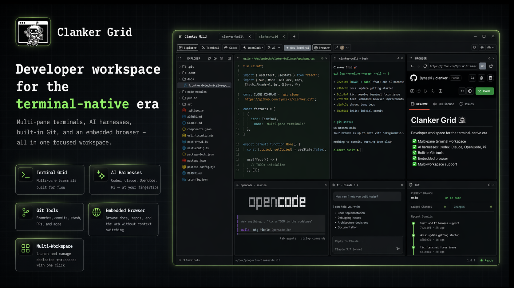

# Clanker Grid

> A developer workspace for the terminal-native era.

Clanker Grid is a single-window desktop app that brings your terminals, AI coding agents, git tools, and a browser together in one focused workspace. It's built for developers who live in the terminal and want their tools to live there too.

[](https://electronjs.org/)
[](https://react.dev/)
[](https://www.typescriptlang.org/)
[](LICENSE)

## What it does

- **Terminal grid** — multiple terminal panes in flexible split layouts, with proper copy/paste.
- **AI harnesses** — launch Claude, Codex, OpenCode, or Pi straight into a pane, and resume past sessions from a searchable history.
- **Git, built in** — branches, stashes, merges, diffs, remotes, and AI-assisted commits without leaving the app.
- **VCS at a glance** — PR status, CI checks, and quick links from GitHub, GitLab, and Bitbucket.
- **Embedded browser** — keep docs, dashboards, or your local app open right next to your code.
- **Editor & file tree** — CodeMirror-backed editing with syntax highlighting and a familiar explorer.
- **Multi-workspace** — every project gets its own tab; switch context without losing it.
- **Credentials handled** — SSH key generation and encrypted PAT storage built in.

## Quick start

```bash
git clone <repo-url>
cd clanker-grid
npm install
npm run dev
```

Requires Node.js 22.12+ and npm 10+.

Windows contributors: install **Git for Windows**. Husky pre-commit hooks execute through the `sh` that ships with Git for Windows.

To build a distributable:

```bash
npm run build
npm run build:dist
```

## Documentation

The full docs are in [`docs/`](docs/):

- [Getting Started](docs/getting-started.md) — installation and first launch
- [Workspaces](docs/workspaces.md) — managing workspace tabs
- [Terminals & Harnesses](docs/terminals.md) — terminal panes and AI integrations
- [Git Integration](docs/git-integration.md) — built-in git tools
- [VCS Providers](docs/vcs-providers.md) — GitHub, GitLab, Bitbucket
- [Browser Annotation](docs/browser-annotation.md) — element selection for AI agents
- [File Explorer](docs/file-explorer.md) — tree navigation and file operations
- [Configuration](docs/configuration.md) — settings and credentials
- [Keyboard Shortcuts](docs/keyboard-shortcuts.md) — quick navigation
- [Windows Notes](docs/windows.md) — Git for Windows, UNC watcher behavior, and long-path setup

For development setup, see [CONTRIBUTING.md](CONTRIBUTING.md). For codebase architecture and agent guidance, see [AGENTS.md](AGENTS.md).

## License

MIT
